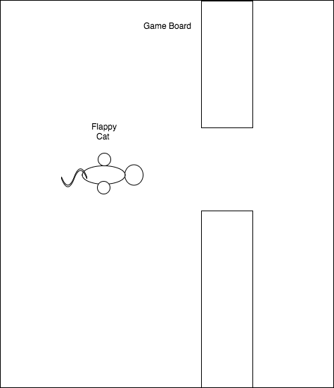

# FlappyCat

### Background

FlappyCat is an infinite runner that is rendered in 2D.

### Functionality & MVP

In FlappyCat, users will be able to:

- [ ] Start and pause the game.
- [ ] Keep flapping the cat's wings to stay afloat.
- [ ] Be able to avoid obstacles.

### Wireframes

This game will consist of a single screen with a space bar controlling the gravity of the cat. It will also have links
to my GitHub and LinkedIn pages. Score will be displayed on the top and there will be a pause button on the top-right corner.

### Architecture and Technologies

This project will be implemented with the following technologies:

- `JavaScript` for game logic,
- `Canvas` with `HTML5 ` for effects rendering,
- `Webpack` to bundle js files.

### Implementation Timeline

**Day 1**: Setup all necessary Node modules, including getting webpack up and running. Doing research on all the libraries I want to use including the physics engine I want to implement, which will handle the gravitational logistics of my cat.

**Day 2**: Work on rendering the board, cat, trees and pipes.

**Day 3**: Implementing the physics for my cat and game logic.

**Day 4**: Install the controls for the user to interact with the game.  Style the frontend, making it polished and professional. Further, I want to fine tune the controls to set a standard difficulty for the game.

### Bonus Features

- [ ] Have a running live scoreboard of all users to play the game.
- [ ] Toggle between day and night while playing the game.
