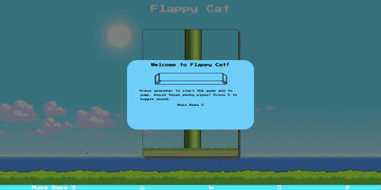

# FlappyCat

### Live Demo

[FlappyCat](https://musa-raza.github.io/flappycat/)

### Context

FlappyCat is a browser game inspired by the extremely hard game from not too long ago, FlappyBird.

### Functionality

In FlappyCat, users are able to:

- [ ] Start and pause the game.
- [ ] Keep flapping the cat to stay afloat.
- [ ] Are able to avoid obstacles.
- [ ] Keep track of score.



### Implementation

To build this game, I used CSS and HTML5 Canvas. For the main character, I used a custom sprite sheet and animations were achieved through `window.requestAnimationFrame`. To switch to another sprite animation, I used a tick counter to keep track of when to change animation as follows:

```js
fall(ctx) {
  this.tickCount += 1;

  if (this.dir === "down") {
    if (this.tickCount > 2) {
      if (this.frameIndex < 7) {
        this.frameIndex = (this.frameIndex + 1);
      }
      this.tickCount = 0;
    }
  }
```
The player jumps through vanilla JS `document.addEventListener`, which listen for keypresses that activate/deactivate the main game modal, cause the bird to jump and toggle the sound.

Collision detection was perhaps the most technically challenging aspect of the game for me. Since I was using one image for pipe rendering to keep the distance between them consistent, I had to come up with a mathematical correlation between the end of the top pipe and bottom pipe. Collision is based on detecting the canvas position of the cat and the pipe. 
